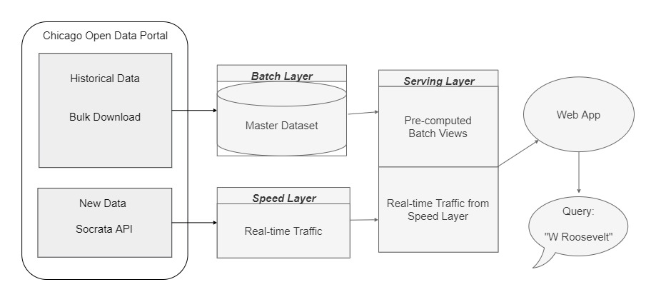
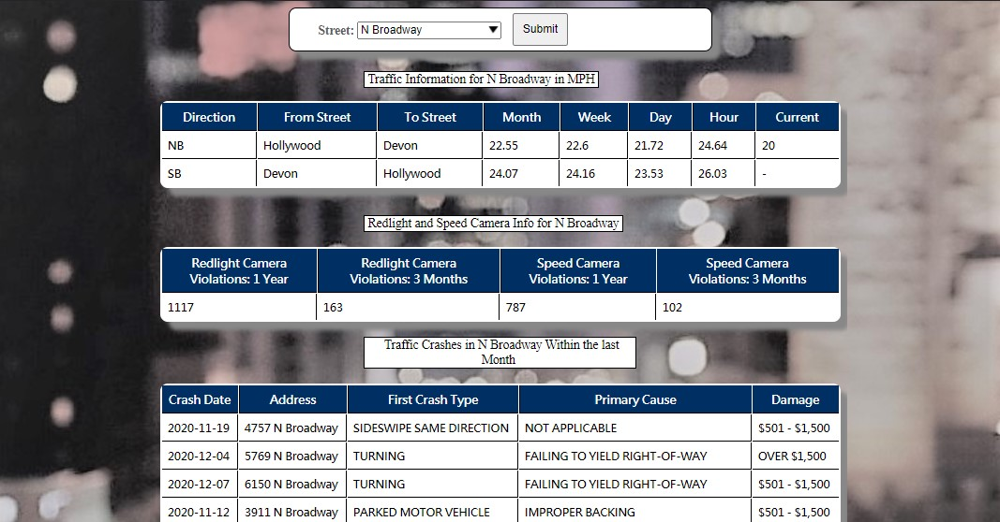
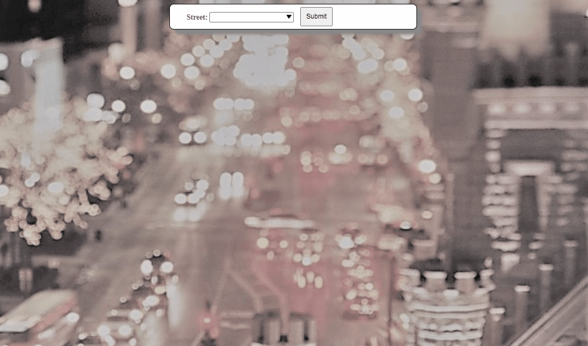

## Chicago Street Statistics

http://mpcs53014-loadbalancer-217964685.us-east-2.elb.amazonaws.com:3113/traffic.html

This project is an application of the Lambda Architecture that tracks the traffic safety and congestion of each street in Chicago. It shows
recent traffic crashes, red light and speed camera violations, and traffic patterns of 1,250 street segments within city limits.

It was completed as the final project for MPCS53014 - Big Data Application Architecture at the University of Chicago.


## Data

All dataset taken from the City of Chicago's open data portal:

- [Traffic Crashes](https://data.cityofchicago.org/Transportation/Traffic-Crashes-Crashes/85ca-t3if) shows each crash that occured
 within city streets as reported in the electronic crash reporting system (E-Crash) at CPD. Citywide data are available starting September 2017. 
- [Red Light Camera Violations](https://data.cityofchicago.org/Transportation/Red-Light-Camera-Violations/spqx-js37) reflects the 
daily number of red light camera violations recorded by the City of Chicago Red Light Program for each camera since 2014.
- [Speed Camera Violations](https://data.cityofchicago.org/Transportation/Speed-Camera-Violations/hhkd-xvj4) 
reflects the daily number of speed camera violations recorded by each camera in Children's Safety Zones since 2014.
- [Historical Traffic Congestion Estimates](https://data.cityofchicago.org/Transportation/Chicago-Traffic-Tracker-Historical-Congestion-Esti/sxs8-h27x)
estimates traffic congestion on Chicago’s arterial streets in real-time by monitoring 
and analyzing GPS traces received from Chicago Transit Authority (CTA) buses.
- [Current Traffic Congestion Estimate](https://data.cityofchicago.org/d/n4j6-wkkf) shows current estimated speed for 
street segments covering 300 miles of arterial roads. Congestion estimates are produced every ten minutes.

The first four datasets were exported in csv and bulk downloaded, and the last dataset gets real-time data through the
Socrata Open Data API 

## Structure

The project implements the three layers of the Lambda Architecture:
- Batch layer - manages the master dataset (the source of truth), which is an immutable, append-only set of raw data. It pre-computes batch views
from the master dataset.
- Serving layer - responds to ad-hoc queries by returning pre-computed views (from the batch layer) or building views from the processed data.
- Speed layer - deals with up-to-date data only to compensate for the high latency of the batch layer 

It also uses a front-end web app to convert output to a graphical interface.



#### Batch Layer

The batch layer stores the master datasets `yson_crashes`, `yson_redlight_cam`, `yson_speed_cam`, and `yson_traffic_hist` in HDFS hosted in Amazon Web Services. 
It ingests the raw historical data through bash scripts and creates Hive tables containg the raw csv data. These are then copied 
and stored in ORC file format.

#### Serving Layer

The serving layer takes the ORC tables in Hive, which were created in the batch layer, and stores them in HBase. These views
can be called through ad-hoc queries that are requested from the web app.

#### Speed Layer

The speed layer consists of two steps: writing reports into Kafka, and reading from the Kafka report to update the batch view.

1. `trafficKafka` implements a Kafka streaming buffer by getting real-time traffic data from the API into Kafka.
It sends the current traffic report via a Java object to Kafka topic called `yson_traffic_2`, where the street name, segment, and traffic are stored.

2. `trafficSpeedLayer` takes the real-time traffic report from Kafka, queries the historical traffic table `yson_street_by_seg` in HBase, 
then combines the two in a Scala object. The HBase table is updated (not incremented) with a new view every timee new data comes in.


#### Web App

The Node.js web application allows users to select a street from a searchable drop-down list. It shows the current traffic
 for each segment of the street and the historical trends for that month and week of the year, day of week, and hour of day.
It also shows the number of red light and speed camera violations in the past year and three months, and traffic crashes that occured in the street in the past month. 

Before submitting:


After submitting:



Demo: 



### Running the app

1. Generate the batch layer: bulk download and ingest csv files to HDFS through `1.getData.sh`, and use Hive to create batch views through `2.ingestToHivesh`.

2. Generate the serving layer with files in `serving_layer` folder.

3. Use `trafficKafka` and `trafficSpeedLayer` Uber jar files to run the speed layer:

- Create a kafka topic `yson_traffic_2` to house incoming traffic data.

    ```
    kafka_2.12-2.2.1/bin/kafka-topics.sh --create --zookeeper z-2.mpcs53014-kafka.fwx2ly.c4.kafka.us-east-2.amazonaws.com:2181,z-3.mpcs53014-kafka.fwx2ly.c4.kafka.us-east-2.amazonaws.com:2181,z-1.mpcs53014-kafka.fwx2ly.c4.kafka.us-east-2.amazonaws.com:2181 --replication-factor 2 --partitions 1 --topic yson_traffic_2
    ```
- Write the live traffic data into Kafka report:

    ```
    java -cp yson/trafficKafka/target/uber-trafficKafka-1.0-SNAPSHOT.jar yson.trafficKafka.TrafficUpdate b-1.mpcs53014-kafka.fwx2ly.c4.kafka.us-east-2.amazonaws.com:9092,b-2.mpcs53014-kafka.fwx2ly.c4.kafka.us-east-2.amazonaws.com:9092
    ```
- We can look at the topic being written here:

    ```
    kafka_2.12-2.2.1/bin/kafka-console-consumer.sh --bootstrap-server b-1.mpcs53014-kafka.fwx2ly.c4.kafka.us-east-2.amazonaws.com:9092,b-2.mpcs53014-kafka.fwx2ly.c4.kafka.us-east-2.amazonaws.com:9092 --topic yson_traffic_2 --from-beginning
    ```
- While the above code is running, start the Spark Streaming job to consume the traffic streaming in from the API through Kafka:

    ```
    spark-submit --master local[2] --driver-java-options "-Dlog4j.configuration=file:///home/hadoop/ss.log4j.properties" --class StreamTraffic yson/trafficSpeedLayer/target/uber-trafficSpeedLayer-1.0-SNAPSHOT.jar b-1.mpcs53014-kafka.fwx2ly.c4.kafka.us-east-2.amazonaws.com:9092,b-2.mpcs53014-kafka.fwx2ly.c4.kafka.us-east-2.amazonaws.com:9092
    ```

Then log into the webserver node and run web app `/webapp/app.js`.

